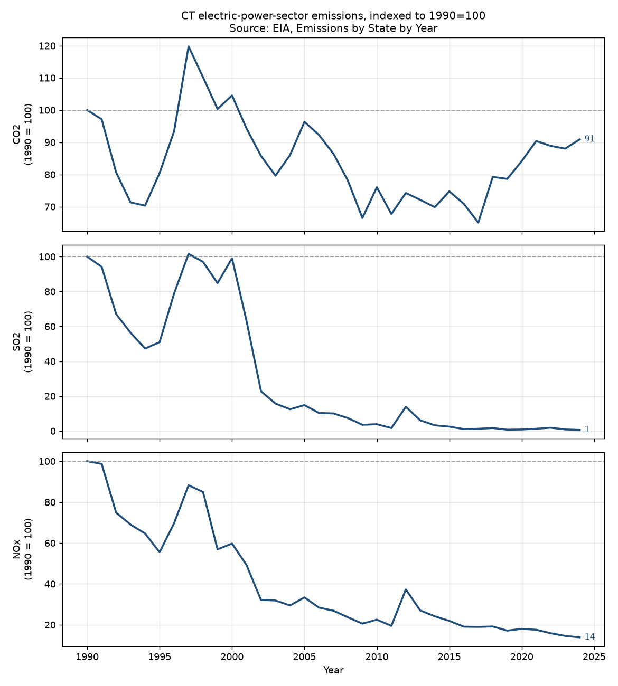
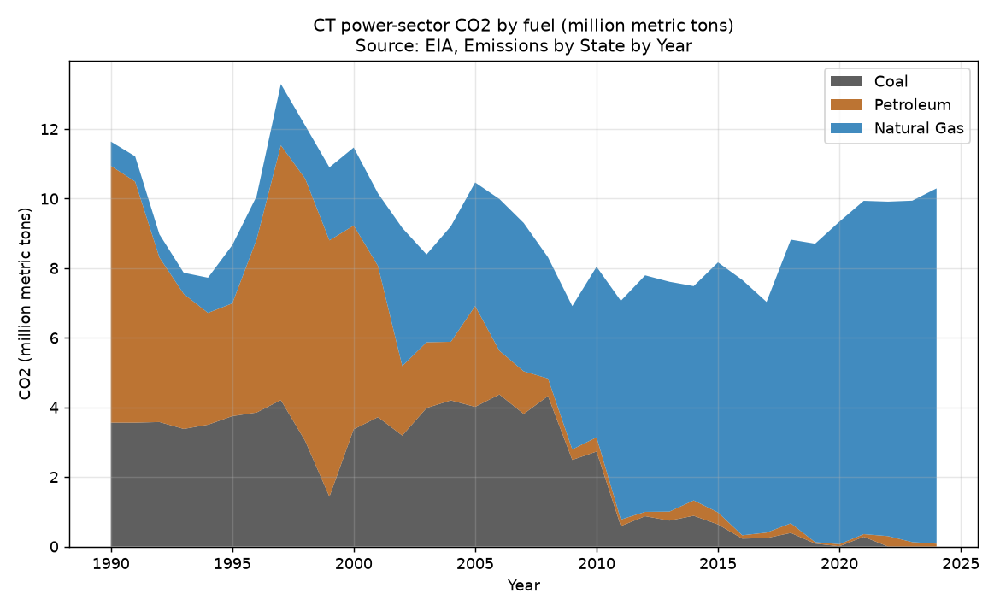
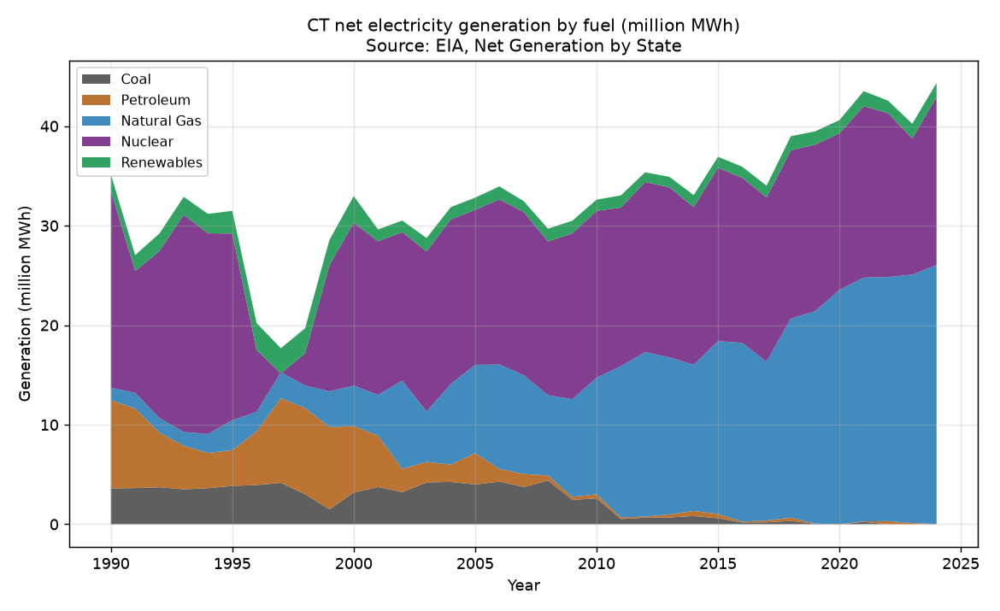
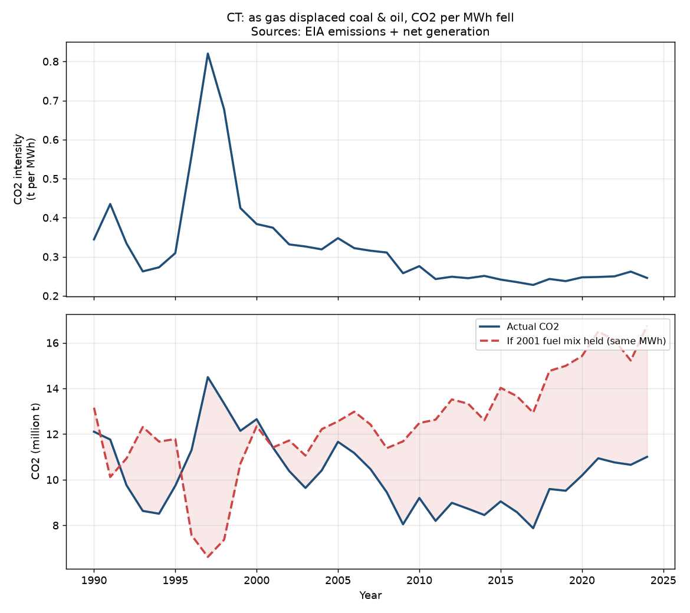

# Claim 01 — Emissions / environmental impact

**CCEA report:** *How Did We Get Here?* (Connecticut Center for Economic
Analysis / Fred Carstensen)
[[PDF]](https://www.conservationeducation.org/uploads/6/2/0/1/6201942/how_did_we_get_here_-_ccea_report.pdf)

**Rebuttal article:** "Natural Gas Does Not Make Electricity More Expensive,"
CBIA
[[link]](https://www.cbia.com/news/issues-policies/natural-gas-does-not-make-electricity-more-expensive)

---

## What CCEA actually claims

CCEA does **not** claim natural gas raised total emissions outright — it
concedes the opposite happened initially:

> "…a startling expansion of investments in utility power generation … *initially
> helped to significantly reduce greenhouse gas emission relative to the use of
> other fossil fuels*." — Executive Summary

Their argument is that Connecticut is nonetheless **"worse off because of the
environmental impact"** because it now generates far more power than it consumes
and exports the surplus, so it keeps the pollution while shipping the
electricity (and the benefit) out of state:

> "…sending so much of the power generated in-state out-of-state does mean that
> Connecticut citizens endured pollution costs from **7.2 MMTCO2e on additional
> emissions**. In 2025, the World Bank values these CO2e emissions from
> electricity generation at **$506.8M**…"

> "Note that energy consumption in Connecticut itself has been declining since
> **2007**, meaning that public health costs in the state resulting from
> shipping power out-of-state have **been rising**."

So the testable empirical claim is: **Connecticut's in-state power-sector
emissions burden has been rising** (post-2007, driven by export-oriented gas
generation), making the state environmentally worse off.

## The data

**Source:** EIA, *Emissions by State by Year* — official electric-power-sector
CO₂, SO₂, and NOx by state and fuel, 1990–2024.
URL: <https://www.eia.gov/electricity/data/state/emission_annual.xlsx>
Scope: **electric power sector only** (not economy-wide).

Reproduce:

```bash
python scripts/download_data.py
python claims/01-emissions/analyze_emissions.py              # CT, 2000 baseline
python claims/01-emissions/analyze_emissions.py --state US-TOTAL
```

## What the data shows

Connecticut power-sector emissions, **indexed to 2000** (the baseline used in the
CBIA article), with the all-time peak for context:

| Pollutant | 2000 | Latest (2024) | **vs 2000** | Peak | vs peak |
|-----------|-----:|--------------:|------------:|-----:|--------:|
| CO₂ (metric tons) | 12,651,961 | 11,001,595 | **−13.0%** | 14,495,967 (1997) | −24.1% |
| SO₂ (metric tons) | 51,721 | 313 | **−99.4%** | 53,078 (1997) | −99.4% |
| NOx (metric tons) | 18,821 | 4,363 | **−76.8%** | 31,512 (1990) | −86.2% |

These are the figures cited in the article — CO₂ down 13%, SO₂ down 99%, NOx
down 77% since 2000 — **and CCEA's own report says generation rose ~50% over
essentially the same period** ("electricity generation 2001-2022/4 rose by nearly
50%"). Emissions fell sharply *while output grew by half*.



### The driver: coal and oil displaced by gas

| Fuel (CO₂, metric tons) | 2000 | 2024 |
|-------------------------|-----:|-----:|
| Coal | 3,370,556 | 0 |
| Petroleum (oil) | 5,858,878 | 81,131 |
| Natural Gas | 2,241,028 | 10,214,445 |

The SO₂ and NOx collapse is almost entirely the retirement of coal and oil —
exactly the displacement the article attributes to natural gas.



## Was it specifically natural gas that raised emissions? No — it lowered them

CCEA's framing implies the gas buildout made Connecticut dirtier. The
generation record (EIA net generation by fuel, MWh) shows the opposite
mechanism. Reproduce with:

```bash
python claims/01-emissions/analyze_generation.py
```

**The production source shifted from coal and oil to gas — with nuclear holding
roughly half throughout:**

| Share of CT net generation | 1990 | 2001 | 2012 | 2024 |
|----------------------------|-----:|-----:|-----:|-----:|
| Coal | 10.2% | 12.3% | 1.8% | **0.0%** |
| Petroleum (oil) | 25.2% | 17.0% | 0.3% | **0.0%** |
| Natural Gas | 3.6% | 13.4% | 45.8% | **58.2%** |
| Nuclear | 56.3% | 50.6% | 47.3% | 37.7% |
| Renewables | 4.7% | 3.9% | 2.7% | 3.1% |



Gas didn't displace clean power — it displaced **coal and oil**, the two
dirtiest fuels on the grid. Because gas emits roughly half the CO₂ of coal per
unit of energy (and a small fraction of the SO₂ and NOx), the **carbon
intensity** of Connecticut's electricity fell as gas took over:

- **CO₂ per MWh fell 34%** from 2001 (0.374 t/MWh) to 2024 (0.246 t/MWh).

**Counterfactual.** If Connecticut had generated its actual 2024 output
(44.8 million MWh) using the **2001 fuel mix**, it would have emitted **~16.75
million tons** of CO₂ instead of the actual **11.0 million**. The switch to gas
**avoided roughly 5.75 million tons of CO₂ in 2024 alone** — on top of the SO₂
and NOx collapse.



So the only thing that nudged *total* CO₂ up after 2007 was the **volume** of
electricity generated, not the fuel. Gas is precisely what kept that growth from
translating into higher emissions. (The intensity spike in 1996–99 on the chart
is the period Millstone's nuclear units were offline and the state burned more
coal and oil — a preview of what a *less* gas-reliant mix looked like.)

## Where does the "~50% increase" in generation actually start?

CCEA writes that "electricity generation 2001-2022/4 rose by nearly 50%." That
is arithmetically true only because of the **start year**:

| Generation growth to 2024 | Change |
|---------------------------|-------:|
| from **2001** (CCEA's baseline) | **+46.8%** |
| from 2000 | +35.8% |
| from 2007 | +34.9% |
| from **1990** | **+27.4%** |
| from 2012 (the gas-initiative year) | +23.9% |

**2001 is a cyclical low.** Connecticut's Millstone nuclear units were shut down
by the NRC from 1996 to 1999, so 1996–2001 was a depressed-and-recovering window
for in-state generation (visible as the trough in the generation chart above).
Anchoring on 2001 maximizes the apparent growth. Measured from 1990, generation
rose **27%, not ~50%** — and almost half of the post-2001 increase (+18.5% from
2001 to 2012) was already in place **before** the 2012 natural-gas initiative
could have driven new plant output. The "~50%" is real arithmetic on a
cherry-picked trough, not a clean signature of the gas expansion.

## Verdict

**The "environmentally worse off" framing is not supported by the absolute
emissions record.** Even as Connecticut became New England's largest generator
and output rose ~50%, total power-sector CO₂ fell 13%, and the criteria
pollutants that most directly drive local public health — NOx and SO₂ — fell 77%
and 99%. A state whose air pollution from power generation has fallen by these
margins is not plausibly "worse off" environmentally because of that generation.

## Honest treatment of CCEA's strongest sub-points

A credible line-by-line review has to engage CCEA's framing on its own terms:

1. **The 2007 baseline.** CCEA anchors "rising costs" on 2007, when in-state
   *consumption* peaked. Measured from 2007, CT power-sector **CO₂ is up ~5.1%**
   (10.46M → 11.00M t). That is the kernel of truth in the claim — but it is
   baseline-shopping: from 2000, or from the 1997/2007 emissions peaks, CO₂ is
   down, and even from 2007 **SO₂ (−94%) and NOx (−49%) kept falling steeply**.
   The 2007 line is marked on the chart above so readers can see this directly.

2. **"7.2 MMTCO2e of additional emissions" from exports.** CCEA assigns the CO₂
   of exported power to Connecticut and prices it at the social cost of carbon.
   But (a) CO₂ is a global pollutant — those tons are not local "public health"
   exposure; and (b) exported gas generation displaces *dirtier* marginal
   generation elsewhere in the region, so attributing it as pure added harm to
   Connecticut double-counts. For the *local* health pollutants that actually
   vary with where power is burned (NOx, SO₂), the in-state trend is sharply
   down, and per the article's EPA point, **90–95% of Connecticut's measured
   pollution is attributable to out-of-state sources** — not its own power plants.

3. **Scope.** This dataset is the electric power sector only. CCEA's claim is
   also about the power sector, so the comparison is apples-to-apples; economy-
   wide emissions (transportation, heating) are a separate question handled under
   other claims.
